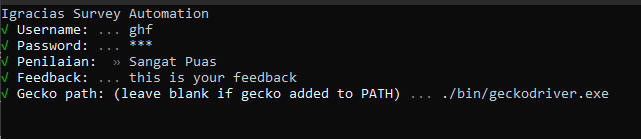

# I-Gracias Survey Automation

You can get the executable from [here](https://github.com/ghufr/igracias-survey-automation/releases), this program built for automating the cumbersome process of fill up surveys in [I-Gracias](https://igracias.telkomuniversity.ac.id/)

> :warning: **Due to weird flow of filling form in igracias, you'll still need to submit questionaire manually**

## Running from Source

**Requirement:**

- Node.js
- `Npm` or `yarn`
- [Mozilla gecko driver](https://github.com/mozilla/geckodriver/releases) placed in local directory or in system PATH.

**Steps:**

1. Clone this project
1. Create `.env` file in project directory _(see `.env.example` as reference)_
1. Edit `config.js` file (`rating`, `feedback`)
1. Open terminal in project directory and run `npm run start` or `yarn start`
1. Done

## Running from executable

**Requirement**

- Mozilla gecko driver
- Windows

**Steps**:

1. Just double click the executable (windows only)
2. Insert `username`, `password`, `rating`, `feedback` and `driver path`\*
3. Done

\*You will need to download the `geckodriver` and copy the path.

## Troubleshoot

- Make sure you have gecko driver in system PATH or in local directory, if you put in local directory, please edit `config.js` file.
- How to add system [PATH](https://docs.telerik.com/teststudio/features/test-runners/add-path-environment-variables)
