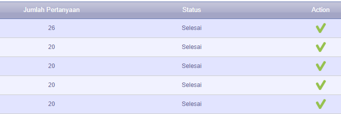

# I-Gracias Survey Automation

You can get the executable from [here](https://github.com/ghufr/igracias-survey-automation/releases), this program built for automating the cumbersome process of fill up surveys in [I-Gracias](https://igracias.telkomuniversity.ac.id/)

## Running from Source

**Requirement:**

- Node.js
- `npm` or `yarn`
- [Mozilla gecko driver](https://github.com/mozilla/geckodriver/releases) placed in local directory or in system PATH.

**Steps:**

1. Clone this project
1. Create `.env` file in project directory _(see `.env.example` as reference)_
1. Edit `config.js` file (`rating`, `feedback`)
1. `npm install` or `yarn`
1. Open terminal in project directory and run `npm run start` or `yarn start`

## Running from executable

**Requirement**

- Mozilla gecko driver
- Windows OS

**Steps**:

1. Just double click the `cli.exe` (windows only)
2. Insert `username`, `password`, `rating`, `feedback` and `driver path`\*

\*You will need to download the `geckodriver.exe` > copy the relative path / append %Path with absolute path of `geckodriver.exe` and leave `driver path` empty (default).

## Troubleshoot

- Make sure you have gecko driver in system PATH or in local directory, if you put in local directory, please edit `config.js` file.
- How to add system [PATH](https://docs.telerik.com/teststudio/features/test-runners/add-path-environment-variables)
